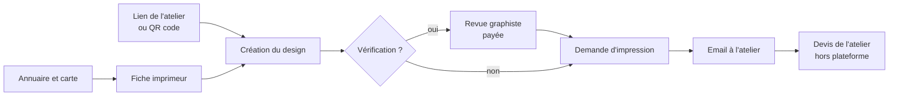
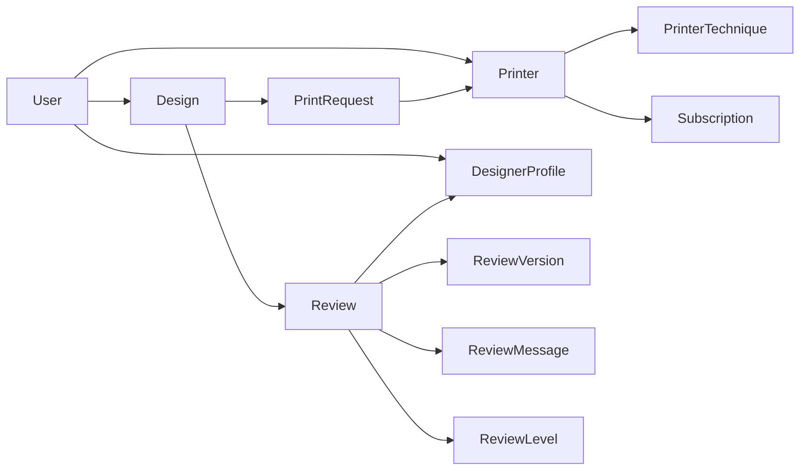
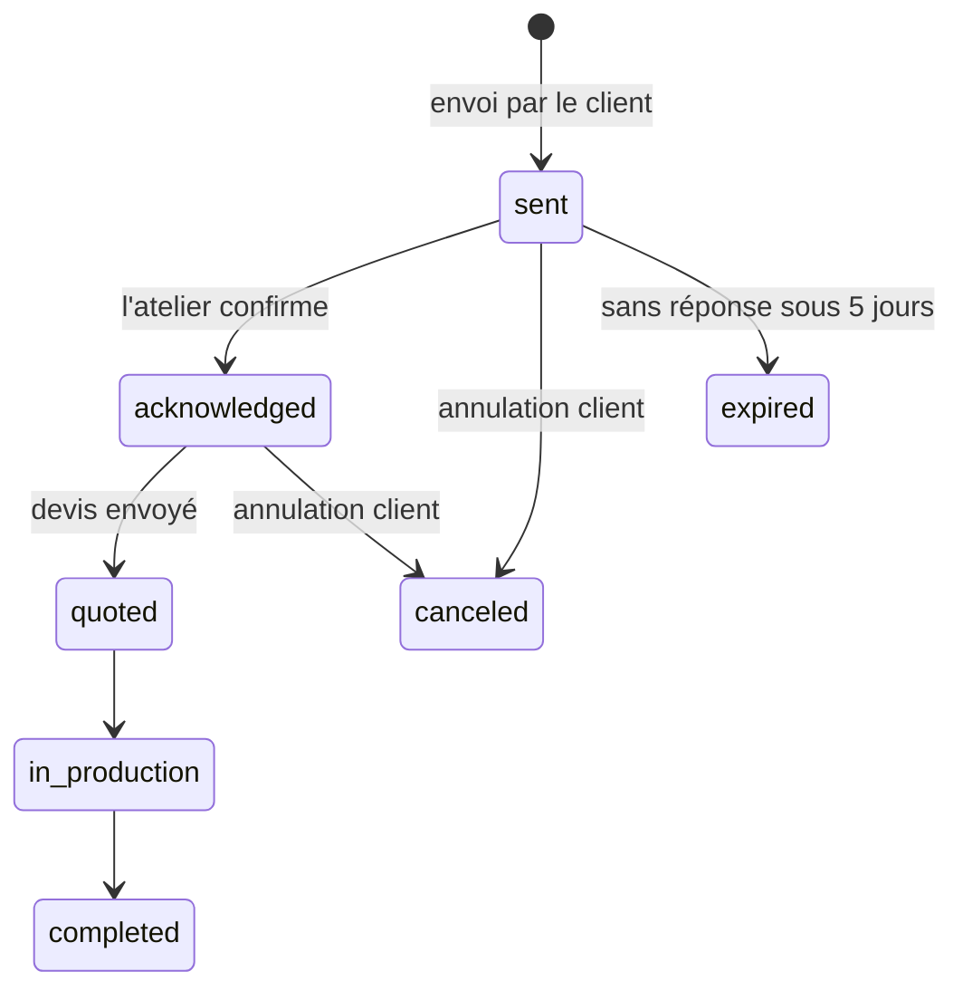
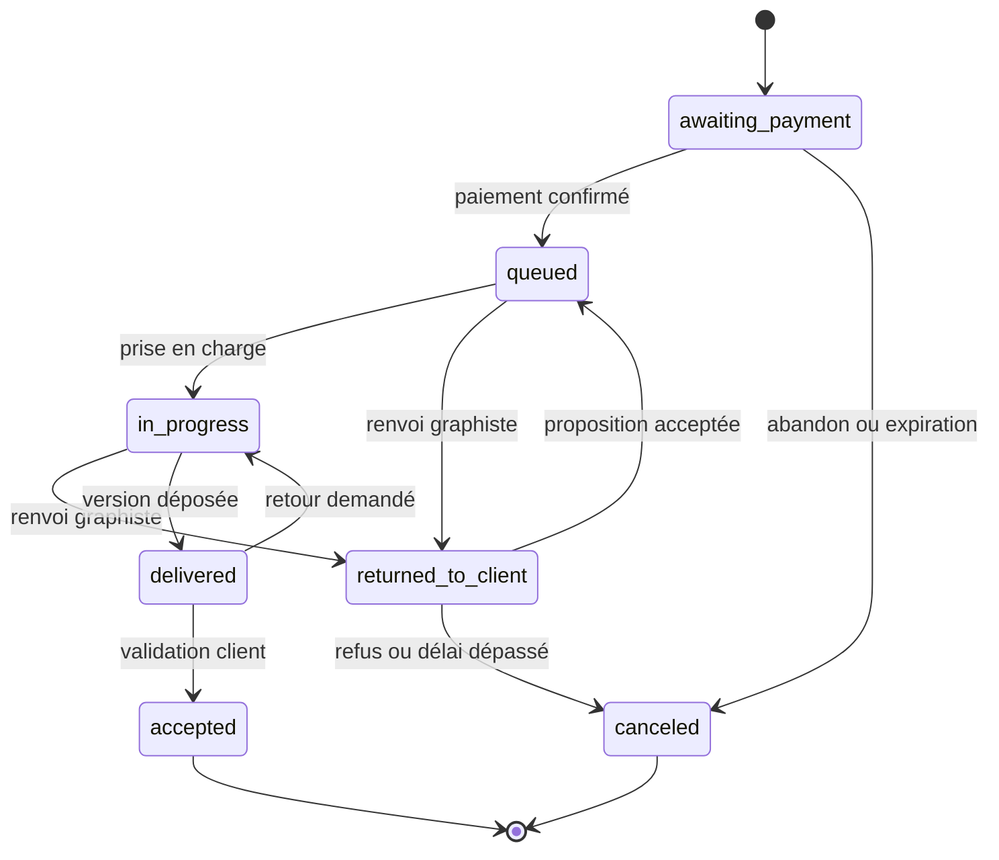

# Prêt-à-tirer — cahier des charges de l'application Rails

2026-09-17 · @Someone

## Prompt pour Claude Code

Exporte ce document en Markdown dans le dépôt sous `docs/SPEC.md`, place le microservice déjà livré dans `services/generator/`, puis colle ce prompt dans Claude Code.

```text
Tu construis une application Ruby on Rails 8 à partir du cahier des charges docs/SPEC.md. Lis-le en entier avant d'écrire la moindre ligne de code.

Règles de travail :
- Commence par créer CLAUDE.md à la racine : stack, commandes utiles, conventions, et un rappel de ces règles.
- Suis le « Plan de construction » étape par étape. À la fin de chaque étape : tests verts (bin/rails test et tests système), rubocop et brakeman propres. Puis arrête-toi, résume ce qui est fait et ce qui reste, et attends ma validation.
- Ne change pas la stack décidée. N'ajoute aucune gem qui n'est pas listée sans m'expliquer pourquoi et attendre mon accord.
- Si un point du cahier des charges est ambigu, contradictoire ou listé dans « Décisions ouvertes », pose la question au lieu de deviner. En attendant, utilise une valeur de configuration clairement marquée.
- Le microservice de génération existe déjà dans services/generator/ (FastAPI). Ne le réécris pas : consomme son API telle que décrite. En développement, lance-le en mode mock ; dans les tests, remplace-le par WebMock.
- Interface en français (fichiers de locale), code, tables et modèles en anglais.
- Aucun secret en dur ni dans le dépôt : credentials Rails ou variables d'environnement.
- Chaque machine à états est testée transition par transition, y compris les transitions interdites.
- Chaque action d'un contrôleur passe par une policy Pundit, et chaque requête est limitée aux données de l'utilisateur connecté.
- Reprends les tokens visuels et la structure des écrans décrits dans « Écrans et routes ».

Commence par l'étape 0.
```

## Vision et périmètre

La plateforme se vend aux imprimeurs textiles : ils paient un abonnement pour être référencés, et envoient leurs clients créer un design IA directement imprimable.

**Problème.** Les clients arrivent avec des images IA en pixels : impossibles à vectoriser proprement pour la sérigraphie, et trop petites pour une machine numérique.

**Solution.** Le client arrive avec la technique que son atelier lui a indiquée. L'IA génère un visuel **conçu pour cette machine** — aplats bornés aux encres de l'atelier en sérigraphie, illustration détaillée et dégradés en DTF — et le service produit le fichier que cette machine attend : SVG vectorisé, ou image matricielle détourée en 300 dpi à la taille d'impression. L'atelier reçoit par email une demande complète : le fichier d'impression, la technique, la palette, le textile, l'emplacement, les tailles et les quantités. Il répond avec son devis, hors plateforme.

| Source de revenus | Qui paie | Fréquence | Montant |
| --- | --- | --- | --- |
| Abonnement Référencement | Imprimeur | Mensuel | \[PRIX\] |
| Abonnement Atelier+ | Imprimeur | Mensuel | \[PRIX\] |
| Vérification par un graphiste | Client | À l'acte | Prix du niveau, commission plateforme \[TAUX\] |

**Dans la V1 :**

- comptes client, imprimeur, graphiste et admin ;
- génération et vectorisation via le microservice existant ;
- lien et QR code personnels par imprimeur ;
- annuaire des imprimeurs avec carte, filtres et compatibilité avec le design ;
- demande d'impression envoyée par email, avec confirmation de réception par lien ;
- vérification payante par un graphiste, y compris le renvoi au client quand l'option choisie ne convient pas ;
- abonnements imprimeurs et paiements des vérifications via Stripe ;
- espaces client, imprimeur, graphiste et admin.

**Hors V1 :**

- paiement de l'impression sur la plateforme (l'atelier envoie son devis directement) ;
- suivi de production détaillé côté imprimeur, au-delà des statuts simples ;
- application mobile native (Hotwire Native, après la V1) ;
- éditeur de placement libre du design sur le t-shirt.

## Rôles et parcours

Quatre rôles connectés partagent un seul modèle `User` ; un utilisateur a exactement un rôle.

| Rôle | Ce qu'il fait | Espace |
| --- | --- | --- |
| Visiteur | Consulte l'accueil, l'annuaire et les fiches ; doit créer un compte pour générer | Pages publiques |
| Client | Crée des designs, demande une vérification, envoie des demandes d'impression, suit tout | `/mon-espace` |
| Imprimeur | S'abonne, remplit sa fiche, partage son lien et son QR code, reçoit et traite les demandes | `/atelier` |
| Graphiste | Réalise les vérifications, dépose les versions, peut renvoyer une demande au client | `/studio` |
| Admin | Valide imprimeurs et graphistes, gère litiges, remboursements, niveaux et liste de termes bloqués | `/admin` |

### Parcours client



Un client arrivé par `/a/:slug` a l'atelier présélectionné pendant toute sa session. Il peut en changer depuis le bandeau de l'écran de création.

### Espace client

- **Tableau de bord** : les actions qui l'attendent en premier (version à valider, proposition d'un graphiste à laquelle répondre, demande sans réponse de l'atelier), puis l'activité récente.
- **Mes designs** : grille des designs avec variantes, technique, nombre d'encres ou taille du fichier selon la famille, date, atelier associé ; actions : créer une variante, demander une vérification, envoyer à un atelier, supprimer.
- **Mes demandes d'impression** : atelier, quantités, statut, date d'envoi ; action : annuler tant que l'atelier n'a pas envoyé de devis.
- **Mes vérifications** : niveau, graphiste, statut, échéance ; page de détail avec les versions, la messagerie, les boutons valider ou demander un retour, et la réponse à une proposition de changement d'option.
- **Mon compte** : coordonnées, mot de passe, export des données, suppression du compte.

### Parcours imprimeur

1. Inscription, puis abonnement via Stripe Checkout.
2. Remplissage de la fiche ; publication après validation par l'admin.
3. Partage du lien `/a/:slug`, du QR code et de l'affiche comptoir.
4. Réception des demandes par email ; confirmation de réception par lien, puis mise à jour du statut depuis l'email ou l'espace atelier.

### Parcours graphiste

1. Inscription, profil, portfolio et niveaux acceptés ; validation par l'admin.
2. Onboarding Stripe Connect ; pas de prise en charge tant que les versements ne sont pas activés.
3. Prise en charge d'une revue, dépôt d'une version, échanges avec le client.
4. Si l'option choisie par le client ne convient pas, renvoi de la demande au client avec une proposition (voir « Machines à états »).

## Stack technique

Rails 8 monolithique avec Hotwire ; seul le moteur de génération reste un service Python séparé.

| Besoin | Choix |
| --- | --- |
| Langage et framework | Ruby 3.3 ou plus, Rails 8.x |
| Base de données | PostgreSQL 16 (colonnes `jsonb` et tableaux) |
| Interface | Hotwire (Turbo, Stimulus), importmap, `tailwindcss-rails` avec les tokens ci-dessous |
| Authentification | Générateur d'authentification Rails 8, rôle en `enum` sur `User` |
| Autorisations | `pundit` |
| Machines à états | `aasm` |
| Tâches de fond | Solid Queue ; Solid Cache ; Solid Cable pour les Turbo Streams |
| Fichiers | Active Storage, disque local en développement, stockage compatible S3 ensuite |
| Paiements | `stripe` : Checkout, Billing, Customer Portal, Connect Express, webhooks |
| Géocodage | `geocoder` avec l'API Adresse du gouvernement (vérifier l'adresse actuelle du service) |
| Carte | Leaflet via importmap, fonds OpenStreetMap, attribution affichée |
| QR code | `rqrcode` (SVG et PNG) |
| Anti-robot | Cloudflare Turnstile, petit service maison de vérification |
| Emails | Action Mailer ; `letter_opener_web` en développement ; fournisseur de production \[À CHOISIR\] |
| Tests | Minitest, fixtures, tests système Capybara, `webmock`, `stripe-ruby-mock` ou faux client Stripe |
| Qualité | `rubocop-rails-omakase`, `brakeman`, `bundler-audit`, CI GitHub Actions |
| Déploiement | Kamal, plus tard ; en démo, machine locale derrière un tunnel Cloudflare |

**Conventions**

- Logique métier dans `app/services` (objets à une méthode `call`) ; contrôleurs minces.
- Intégrations externes isolées : `GeneratorClient`, `Payments::*`, `TurnstileVerifier`, `Geocoding`.
- Montants en centimes (`*_cents`, entiers) ; devise EUR.
- Fuseau `Europe/Paris`, locale par défaut `fr`.
- Polices auto-hébergées dans `app/assets/fonts` : pas d'appel à Google Fonts depuis le navigateur.

**Tokens visuels** (repris des maquettes)

| Token | Valeur | Usage |
| --- | --- | --- |
| `paper` | #F2F4F3 | Fond des pages |
| `surface` | #FFFFFF | Panneaux et champs |
| `ink` | #1D2433 | Texte, barre latérale des espaces pros |
| `muted` | #505A67 | Texte secondaire |
| `line` | #C8D0D4 | Bordures |
| `emulsion` | #1F5F7A | Couleur d'action principale |
| `success` | #1E6B40 sur #E4F2EA | Compatibilité, validations |
| `warning` | #6B4200 sur #FFF3DC | Alertes d'impression |
| Titres | Barlow Condensed 600-700 | Titres et chiffres |
| Texte | Figtree 400-700 | Corps et interface |

Le fond des aperçus reprend une trame fine (lignes émulsion à 8 % tous les 8 px), en rappel de l'écran de sérigraphie. Cibles tactiles de 44 px minimum, focus visible, contraste 4,5:1.

## Techniques d'impression

Un atelier n'imprime pas d'une seule façon, et toutes ses machines n'attendent pas un SVG. La technique retenue est donc choisie **avant la génération**, et elle pilote trois choses : le prompt envoyé au modèle, le fichier produit en sortie, et les alertes affichées au client comme jointes à la demande. Un visuel pensé dès la génération pour deux couleurs vaut infiniment mieux qu'un visuel riche réduit après coup : c'est ce qui justifie l'ordre.

| Technique | Clé | Sortie | Encres | Dégradés | Blanc imprimé | Ce qui casse le design |
| --- | --- | --- | --- | --- | --- | --- |
| Sérigraphie | `screen_printing` | SVG | 6 au plus | non | non | traits fins, aplats non fermés |
| Flex ou flocage (découpe) | `flex` | SVG | 2 au plus | non | non | tout détail fin, motif éclaté |
| Broderie | `embroidery` | SVG | 6 fils au plus | non | oui | densité de détail, texte minuscule |
| DTF (transfert numérique) | `dtf` | PNG 300 dpi | sans limite | oui | oui | détourage approximatif |
| DTG (impression directe) | `dtg` | PNG 300 dpi | sans limite | oui | oui | détourage approximatif |
| Sublimation | `sublimation` | PNG 300 dpi | sans limite | oui | **non** | polyester clair seulement |

**Le profil de chaque technique vit dans le microservice** (`services/generator/microservice/app/techniques.py`) et Rails le lit sur `GET /techniques` : les libellés français, la famille de sortie, le plafond d'encres et le nom du fichier produit. Rails ne duplique pas ces valeurs ; il en garde une copie en cache pour les formulaires et l'affichage. La lecture ne déclenche jamais d'appel réseau : un job rafraîchit le cache, et un cache froid retombe sur une copie de secours versionnée dans `config/print_techniques.yml`, clairement marquée comme telle. Un atelier peut donc remplir sa fiche pendant que la machine de génération dort.

**Le catalogue donne le mode, l'atelier dit ce qu'il y a derrière.** La clé de technique est ce que choisit le client — sérigraphie, sublimation — et c'est elle qui part au service. Tout le reste appartient à l'atelier, qui déclare pour chacune de ses techniques :

- le **nom affiché**, dans ses mots (« Flocage 1 couleur », « Impression photo ») ; vide, le libellé du catalogue s'applique ;
- le **format de fichier attendu** (SVG, PNG, PDF) : deux ateliers qui font de la sublimation n'attendent pas forcément le même fichier, et c'est l'atelier qui sait ce que sa machine avale ;
- l'**espace colorimétrique** (RVB ou CMJN), qui décide aussi de ce que le client voit à l'écran — il doit valider ce qui sera imprimé, pas une approximation ;
- son propre **plafond d'encres**, borné par celui du catalogue, ses **dimensions maximales**, et une **précision** libre.

Le client ne voit jamais ces réglages : il choisit un mode, l'atelier reçoit le fichier qu'il a demandé, et l'email de demande d'impression joint ce fichier-là.

⚠ **Ce que le service ne sait pas encore faire.** `POST /generate` déduit le format de sortie de la famille de la technique et n'accepte pas de format explicite. Un atelier qui demande un SVG en sublimation déclare donc aujourd'hui une attente que la génération ne satisfait pas encore : il faudra que le service accepte un `output_format`, et que l'aperçu client s'aligne sur lui. Rails est prêt, le service ne l'est pas.

**Choix de la technique dans le parcours.** Le client arrive presque toujours sur recommandation de son atelier, donc la technique lui est connue.

- Arrivé par `/a/:slug`, il ne voit que les techniques que **cet** atelier pratique. Une seule technique déclarée : elle est retenue sans rien demander.
- Arrivé par l'annuaire, il voit le catalogue complet, puis l'annuaire ne lui propose que les ateliers compatibles.
- Le libellé montré est humain — « flocage 1 couleur », « impression photo toutes couleurs » — la mention technique venant en second. Une option « je ne sais pas » retombe sur la technique marquée `primary` de l'atelier en contexte, et sur `screen_printing` sans atelier.
- Le curseur d'encres n'apparaît que pour les techniques à encres comptées ; ailleurs il n'a pas de sens et le formulaire ne l'affiche pas.

**Ce que la résolution du modèle impose aux sorties matricielles.** SDXL dessine en 1 024 pixels de côté (`IMAGE_SIZE`). Le fichier livré fait toujours 300 dpi, mais le dessin, lui, ne fournit que 1 024 pixels : au-delà d'environ 9 cm de large, les pixels supplémentaires sont interpolés. Le service renvoie donc `source_dpi` et `net_width_cm` dans ses statistiques, et prévient le client sous 150 dpi réels — seuil au-delà duquel un atelier accepte couramment un fichier DTF. Une poitrine de t-shirt se demandant plutôt en 25 cm, ce message serait la règle et non l'exception : **la V1 doit donc agrandir avant de livrer**, par un nœud d'agrandissement dans le workflow ComfyUI de la machine de génération, ou par un `IMAGE_SIZE` plus élevé. C'est un réglage de la machine de génération, pas du code Rails ; en attendant, l'avertissement dit la vérité au client.

**Changer de technique après coup.** La technique est figée sur le design : elle a façonné le prompt, pas seulement le fichier. Un client qui choisit un atelier incompatible se voit proposer une **nouvelle création** pour la technique de cet atelier, pas une conversion de fichier. Cette re-génération consomme le quota journalier et **ne consomme pas** le budget de reprises, qui appartient à la lignée précédente.

## Modèle de données

Quatorze modèles, compteur de quota compris ; les fichiers passent par Active Storage et les statuts par AASM.



| Modèle | Champs principaux | Règles |
| --- | --- | --- |
| `User` | email, password\_digest, first\_name, last\_name, phone, city, role (client, printer, designer, admin), terms\_accepted\_at, deleted\_at | Email unique ; suppression douce puis purge |
| `Printer` | user\_id, name, slug, description, address, postal\_code, city, latitude, longitude, orders\_email, phone, website, opening\_hours, response\_time\_hours, min\_order\_qty, standard\_lead\_days, express\_available, express\_lead\_hours, ships, shipping\_zones, shipping\_lead, shipping\_price\_note, pickup, provides\_textile, accepts\_client\_textile, textile\_brands, textile\_label (none, gots, oeko\_tex), placements (tableau), max\_print\_width\_cm, max\_print\_height\_cm, price\_note, brand\_color, status (draft, pending\_review, published, suspended), featured ; pièces jointes logo et photos | Slug unique ; géocodé à chaque changement d'adresse ; visible si `published` et abonnement actif |
| `PrinterTechnique` | printer\_id, technique (clé du catalogue), **label**, **output\_format** (svg, png, pdf), **color\_space** (rgb, cmyk), max\_colors, primary, max\_print\_width\_cm, max\_print\_height\_cm, note | Une ligne par technique pratiquée ; `technique` est une clé du catalogue, jamais une liste recopiée dans Rails ; `label` vide retombe sur le libellé du catalogue ; `max_colors` requis et borné par le plafond de la technique pour celles à encres comptées, **interdit** pour les autres ; une seule ligne `primary` par atelier, garantie par un index unique partiel autant que par une validation ; les dimensions vides retombent sur celles de la fiche |
| `Subscription` | printer\_id, plan (listing, atelier\_plus), status (incomplete, trialing, active, past\_due, canceled), stripe\_customer\_id, stripe\_subscription\_id, current\_period\_end | Mise à jour uniquement par les webhooks Stripe |
| `Design` | user\_id, printer\_id (contexte, facultatif), parent\_id (variante), prompt, style (illustration, logo, mascotte, badge), **technique**, **print\_format** (svg, png), **print\_width\_cm**, colors\_requested, remove\_background, seed, status, generator\_job\_id, error\_message, inks\_count, palette (jsonb), paths\_count, warnings (jsonb), prompt\_used, subject, root\_id, mode (create, variant, refine), instruction, refinements\_left, deleted\_at ; pièces jointes **print\_file** et source\_png | `technique` obligatoire, figée à la création et héritée par toute la lignée ; `print_format` en découle et dit si `print_file` est un SVG ou un PNG ; `colors_requested` borné par le plafond de la technique **puis** par celui de l'atelier ; `paths_count` et `inks_count` ne sont renseignés qu'en sortie vectorielle ; `parent_id` et `root_id` forment la lignée, indexés tous les deux |
| `DesignerProfile` | user\_id, display\_name, bio, city, latitude, longitude, remote, specialties (tableau), languages (tableau), accepting\_work, status (pending\_review, active, suspended), stripe\_account\_id, payouts\_enabled, rating\_avg, ratings\_count ; pièces jointes avatar et portfolio | Ne reçoit rien tant que `payouts_enabled` est faux |
| `ReviewLevel` | key (check, retouch, custom), name, description, price\_cents (vide pour « sur devis »), turnaround\_hours, revisions\_included, position, active | Géré par l'admin |
| `DesignerLevel` | designer\_profile\_id, review\_level\_id | Niveaux acceptés par le graphiste |
| `Review` | design\_id, client\_id, designer\_profile\_id (vide si « premier disponible » non attribué), review\_level\_id, assignment\_mode (chosen, first\_available), status, client\_brief, price\_cents, platform\_fee\_cents, revisions\_included, revisions\_used, due\_at, paid\_at, accepted\_at, stripe\_checkout\_session\_id, stripe\_payment\_intent\_id, return\_reason\_code, return\_message, proposed\_level\_id, proposed\_price\_cents, returned\_at, proposal\_expires\_at | Voir la machine à états |
| `ReviewVersion` | review\_id, number, message, checks (jsonb), inks\_count ; pièce jointe file | Numérotation continue ; la version déposée respecte le `print_format` du design (un graphiste ne renvoie pas un PNG là où l'atelier attend un SVG) ; un SVG est contrôlé avant enregistrement, un PNG est vérifié en type, en dimensions et en résolution |
| `ReviewMessage` | review\_id, author\_id, body, read\_at | Visible par le client, le graphiste et l'admin |
| `Rating` | review\_id, score (1 à 5), comment | Un seul par revue, après validation |
| `PrintRequest` | design\_id, review\_version\_id (facultatif), client\_id, printer\_id, status, textile\_source (printer, client), textile\_model, textile\_color, placements (tableau), print\_width\_cm, sizes (jsonb, taille vers quantité), total\_qty, desired\_on, message, contact\_name, contact\_email, contact\_phone, contact\_city, consent\_text\_version, consented\_at, confirmation\_token, sent\_at, acknowledged\_at, quoted\_at, reminded\_at ; pièces jointes final\_file et preview\_png | Copie des fichiers à l'envoi ; la technique du design est reprise dans l'email et la fiche technique ; `total_qty` calculé |

**Quota de génération.** Table `generation_counters` (user\_id, day, count), index unique sur user\_id et day. Une génération échouée ne consomme pas de quota.

**Compatibilité atelier.** La compatibilité ne se juge plus sur le format du fichier mais sur la technique du design. Un atelier peut imprimer un design si :

1. il pratique la technique du design — sinon il est incompatible, quelles que soient ses autres machines ;
2. pour une technique à encres comptées (sérigraphie, flex, broderie), son `max_colors` est supérieur ou égal à `inks_count` ;
3. la taille d'impression demandée tient dans les dimensions déclarées pour cette technique.

Chaque échec porte sa raison, affichée telle quelle dans l'annuaire : « ne pratique pas le DTF », « 2 encres maximum, le design en compte 4 », « largeur maximale 20 cm ». La règle vit dans `PrinterCompatibility` et sert à l'annuaire, à la fiche et à l'écran de création.

## Machines à états

Trois objets ont un cycle de vie : le design, la demande d'impression et la revue graphiste, qui porte le renvoi au client.

### Design

`pending` → `generating` → `ready` ou `failed`. Un design `failed` peut être relancé ; il ne consomme pas de quota. Un design `ready` est immuable : une variante ou une retouche crée un design enfant (`parent_id`), rattaché à la même lignée (`root_id`).

### Demande d'impression



- À l'envoi, l'atelier reçoit l'email avec les fichiers joints et un lien portant `confirmation_token`.
- **Fiche technique jointe à l'envoi.** L'atelier reçoit le SVG (fichier d'impression) **et** le PNG, plus une fiche reprenant la description du client, `prompt_used`, l'instruction de la dernière retouche s'il y en a eu, la palette hex avec les parts, le nombre d'encres, `seed` et `style`. Le PNG et le prompt disent l'intention là où le SVG a perdu des nuances ; `seed` et `style` permettent de régénérer la même image des mois plus tard.
- Le lien ouvre une page de confirmation ; seul le bouton de cette page (POST) change le statut, car les antivirus de messagerie ouvrent les liens automatiquement.
- Sans confirmation après 48 h : relance à l'atelier. Après 5 jours : statut `expired`, et le client est invité à choisir un autre atelier.
- L'atelier met aussi à jour les statuts depuis `/atelier/demandes`.

### Revue graphiste



| Transition | Déclencheur | Conditions | Effets |
| --- | --- | --- | --- |
| `pay` | Webhook `checkout.session.completed` | Montant conforme | `paid_at` ; notification au graphiste choisi, ou à tous les graphistes disponibles du niveau |
| `claim` | Graphiste | Niveau accepté, versements activés ; en mode « premier disponible », verrou pour qu'un seul graphiste l'obtienne | `designer_profile_id`, `due_at` = maintenant + délai du niveau |
| `deliver` | Graphiste dépose un SVG | SVG valide (voir Sécurité) | Nouvelle `ReviewVersion` ; email au client |
| `request_revision` | Client | `revisions_used` < `revisions_included` ; message obligatoire | `revisions_used` + 1 ; nouveau `due_at` |
| `accept` | Client, ou automatiquement 7 jours après la dernière livraison | Au moins une version | `accepted_at` ; transfert au graphiste ; invitation à noter |
| `return_to_client` | Graphiste | Aucune version livrée ; motif et message obligatoires ; une seule fois par revue | `returned_at`, `proposal_expires_at` = maintenant + 72 h ; email au client |
| `accept_proposal` | Client | Proposition non expirée ; paiement ou remboursement de la différence réussi | Niveau et prix mis à jour ; retour en file, chez le même graphiste s'il en a proposé un |
| `decline_proposal` | Client, ou expiration | — | Remboursement intégral ; statut `canceled` |
| `cancel` | Admin | Litige | Remboursement total ou partiel saisi par l'admin |

### Renvoi au client par le graphiste

Le graphiste renvoie la demande quand l'option choisie ne permet pas de faire le travail correctement. Il le fait avant toute livraison, et sa prise en charge n'est pas facturée.

**Motifs proposés** (`return_reason_code`) :

- `level_too_low` : la demande dépasse le niveau payé, par exemple un redessin complet demandé en simple contrôle ;
- `level_too_high` : un niveau inférieur suffit ;
- `unusable_design` : le design est inexploitable, mieux vaut en générer un autre ;
- `forbidden_content` : marque, personnage protégé ou contenu interdit ;
- `other` : message libre obligatoire.

**Proposition.** Pour les deux premiers motifs, le graphiste choisit le niveau proposé. Pour « Création sur mesure », il saisit un prix (`proposed_price_cents`). Les deux autres motifs n'ont pas de proposition : la revue est annulée et remboursée immédiatement, et le client est prévenu par email.

**Côté client**, la page de la revue affiche le motif, le message, le niveau proposé et l'écart de prix, avec deux boutons :

- « Accepter et payer la différence » (nouveau Checkout), ou « Accepter, la différence vous sera remboursée » si le niveau est moins cher ;
- « Refuser et être remboursé », avec un lien pour modifier ou régénérer le design.

**Garde-fous.** Un graphiste ne renvoie pas deux fois la même revue. L'admin voit le taux de renvoi de chaque graphiste et reçoit une alerte au-delà de \[SEUIL\] % sur 30 jours.

### Graphiste choisi indisponible

Si le graphiste choisi ne prend pas la revue en charge dans les 12 h, le client choisit : passer en « premier disponible », choisir un autre graphiste, ou être remboursé.

## Reprise d'un design

Un design `ready` ne se modifie pas : le client le reprend, et chaque reprise crée un enfant de la même lignée (`root_id`). Deux façons de reprendre, et une sortie payante quand le budget est épuisé.

| Reprise | Ce que fait le service | Ce que voit le client |
| --- | --- | --- |
| **Retouche** | L'instruction française est traduite, fusionnée dans la description anglaise du parent, puis le modèle repart **de l'image du parent** en img2img (denoise 0,55) : la composition est conservée, le détail change | Un chat « que voulez-vous changer ? » ; la demande puis la nouvelle version s'affichent comme une conversation |
| **Variantes** | Même description, **trois** autres tirages, chacun étant un design complet (SVG et PNG) | Un bouton « proposez-moi d'autres versions », puis les trois propositions côte à côte |

- **Budget : trois reprises par design**, variantes et retouches confondues. Il est compté par le microservice sur la lignée, et jamais recalculé par Rails : `refinements_left`, renvoyé par chaque appel, fait foi et s'affiche en permanence sous l'aperçu.
- Une reprise consomme le quota journalier de génération, comme une création.
- Budget épuisé : le service répond 429 avec `reason: "refine_budget"`. L'écran remplace alors les deux actions par l'entrée dans le parcours de **vérification par un graphiste** : c'est la suite naturelle, et elle est payante.
- Les variantes sont produites en pleine taille, pas en vignettes : avec SDXL, un même `seed` à une autre résolution ne redonne pas la même image, donc une vignette choisie puis re-rendue dériverait sous les yeux du client.
- La lignée est navigable : le client revoit chaque version et repart de celle qu'il veut. Le graphiste, lui, voit toute la lignée.

## Écrans et routes

Les routes publiques sont en français ; chaque espace a son propre layout et son espace de noms de contrôleurs. Les maquettes de référence sont sur le canevas « Prêt-à-tirer — maquettes ».

### Public et client

| Route | Écran | Accès |
| --- | --- | --- |
| `GET /` | Accueil imprimeurs : avant/après pixel et vecteur, fonctionnement, exemple d'email, abonnements, appel aux graphistes | Tous |
| `GET /a/:slug` | Enregistre l'atelier en session et redirige vers la création | Tous |
| `GET /imprimeurs` | Annuaire : filtres à gauche — **technique d'impression en tête**, puis rayon, textile, délai, livraison — liste au centre, carte à droite ; les ateliers qui livrent partout en France restent visibles hors rayon | Tous |
| `GET /imprimeurs/:slug` | Fiche : présentation, badges, photos, caractéristiques par groupe, carte, contact, compatibilité avec le dernier design | Tous |
| `GET /graphistes`, `GET /graphistes/:id` | Liste avec filtres et carte facultative ; profil avec portfolio et avis | Tous |
| `GET /designs/new` | Création : bandeau de l'atelier, **choix de la technique en premier champ**, formulaire, aperçu sur t-shirt avec couleurs de tissu, vue du fichier d'impression et de l'image d'origine avec zoom, encres et écrans, compatibilité, actions | Client |
| `POST /designs`, `GET /designs/:id` | Lancement puis suivi en Turbo Stream ; la route GET /designs/:id/image télécharge le rendu matriciel du SVG, filigrané — jamais le fichier SVG | Propriétaire |
| `POST /designs/:id/variants` | Trois variantes du design (mêmes mots, autres tirages) | Propriétaire |
| `POST /designs/:id/refine` | Retouche par instruction : le texte du chat part au service, la nouvelle version arrive en Turbo Stream | Propriétaire |
| `GET /designs/:id/print_requests/new`, `POST` | Envoi à l'atelier : textile, emplacement, tailles et quantités, date, message, coordonnées, consentement ; récapitulatif à droite | Propriétaire |
| `GET /designs/:id/reviews/new`, `POST` | Choix du niveau et du graphiste, puis Stripe Checkout | Propriétaire |
| `GET /verifications/:id` | Détail d'une revue : versions, messagerie, valider, demander un retour, répondre à une proposition | Client de la revue |
| `POST /verifications/:id/accept`, `/revision`, `/accept_proposal`, `/decline_proposal`, `/messages` | Actions de la revue | Client de la revue |
| `GET /mon-espace` | Tableau de bord client : actions en attente, puis activité récente | Client |
| `GET /mon-espace/designs`, `/demandes`, `/verifications`, `/compte` | Listes et compte | Client |

### Imprimeur, graphiste, admin

| Route | Écran | Accès |
| --- | --- | --- |
| `GET /demandes/confirmation/:token`, `POST` | Page de confirmation de réception, sans connexion | Porteur du lien |
| `GET /atelier` | Tableau de bord : lien client et QR code, dernières demandes, chiffres du mois, abonnement, fiche à compléter | Imprimeur |
| `GET /atelier/demandes`, `PATCH /atelier/demandes/:id` | Liste filtrable et changement de statut | Imprimeur |
| `GET /atelier/fiche/edit`, `PATCH` | Formulaire de fiche en sections ; aperçu public | Imprimeur |
| `GET /atelier/lien` | QR code en SVG et PNG, affiche comptoir imprimable (CSS d'impression) | Imprimeur |
| `GET /atelier/abonnement` | Formule actuelle ; Checkout ou portail client Stripe | Imprimeur |
| `GET /studio` | File des revues : à traiter, en attente du client, terminées ; tri par échéance | Graphiste |
| `GET /studio/revues/:id` | Demande du client, fichier d'origine et alertes, dépôt de version, messagerie, bouton « Proposer une autre option » | Graphiste attribué |
| `POST /studio/revues/:id/claim`, `/versions`, `/return_to_client`, `/messages` | Actions du graphiste | Graphiste |
| `GET /studio/profil`, `/studio/paiements` | Profil, niveaux acceptés ; lien vers le tableau de bord Stripe Express | Graphiste |
| `/admin/...` | Imprimeurs et graphistes à valider, revues et litiges, remboursements, niveaux, termes bloqués, taux de renvoi | Admin |
| `POST /webhooks/stripe` | Webhooks signés | Stripe |

### Détails d'interface à respecter

- **Création** : la technique se choisit avant tout le reste, en libellés humains, et le reste du formulaire s'y adapte — le curseur de couleurs n'apparaît que pour les techniques à encres comptées, et il est borné au minimum entre le plafond de la technique et celui de l'atelier ; la taille d'impression est demandée pour les techniques matricielles, où elle détermine la définition du fichier. Le compteur de créations restantes s'affiche sous le bouton ; les alertes du service apparaissent en encadré d'avertissement.
- **Aperçu** : l'aperçu principal est le **rendu du fichier d'impression**, pas l'image issue de l'IA — le SVG vectorisé pour les techniques vectorielles, le PNG détouré pour les autres. Ce fichier diffère volontairement de l'image générée : selon la technique, le blanc y est devenu textile non imprimé, les teintes proches ont été fusionnées pour tenir le nombre d'encres, le fond a été retiré. Faire valider l'image d'origine reviendrait à faire approuver autre chose que ce qui sera imprimé. Ce rendu est **produit côté serveur** (libvips) puis filigrané avant d'être servi : le client voit exactement le fichier d'impression, mais le fichier lui-même ne lui est jamais transmis — servir le SVG laisserait retirer le filigrane d'un coup d'éditeur de texte, et servir le PNG en 300 dpi reviendrait à livrer le fichier d'impression. Il s'affiche sur fond clair **et** sur fond sombre, puisque le blanc n'est pas toujours imprimé. Le sélecteur « rendu final / image d'origine » permet de comparer.
- **Reprise** : le chat de retouche et le bouton de variantes sont sous l'aperçu, avec le nombre de reprises restantes toujours visible ; à zéro, les deux laissent place à l'appel à la vérification par un graphiste.
- **Encres** : en sortie vectorielle, chaque couleur s'affiche comme un pot d'encre avec son code, et le titre annonce le nombre d'écrans. En sortie matricielle, ce bloc laisse place à la fiche du fichier : dimensions en centimètres, définition en pixels, 300 dpi, fond transparent, largeur au-delà de laquelle le rendu perd en netteté (`net_width_cm`) — et, quand la machine n'a pas d'encre blanche, la part du dessin qui prendra la couleur du textile.
- **Annuaire** : le filtre « Compatibles avec mon design » est coché par défaut quand un design existe, et il se lit d'abord sur la technique ; les ateliers incompatibles restent affichés en atténué avec la raison (« ne pratique pas le DTF », « 2 encres maximum »). Un atelier incompatible propose, au lieu du bouton d'envoi, de recréer le design pour **sa** technique.
- **Fiche imprimeur** : les techniques pratiquées apparaissent en badges, chacune avec ses limites — encres et dimensions — et la technique principale est marquée.
- **Mise en avant Atelier+** : l'étiquette « Mis en avant » est toujours visible.
- **Espace graphiste** : l'échéance est en rouge sous 6 h ; le renvoi ouvre une fenêtre avec motif, niveau proposé, prix si sur devis et message.
- **Espace client** : une proposition de graphiste apparaît en tête du tableau de bord avec le compte à rebours des 72 h.

## Intégration du microservice

Rails parle au service FastAPI existant en HTTP, depuis des tâches de fond uniquement, avec une clé partagée dans l'en-tête `X-API-Key`.

| Méthode et route | Corps ou paramètres | Réponse |
| --- | --- | --- |
| `POST /generate` | prompt (3 à 300 caractères), style, **technique** (clé du catalogue), colors (1 à 6, facultatif), **print\_width\_cm** (3 à 60), remove\_background, user\_id, seed facultatif | 202 : job\_id, status, position, refinements\_left |
| `POST /jobs/:id/refine` | instruction (3 à 200 caractères), user\_id | 202 : job\_id, status, position, refinements\_left |
| `POST /jobs/:id/variants` | user\_id, count | 202 : job\_ids, job\_id, status, position, refinements\_left |
| `GET /jobs/:id?user_id=` | — | status (queued, running, done, error), position, error, mode, parent\_id, root\_id, refinements\_left, result (**technique**, **technique\_label**, **output** : vector ou raster, **print\_file** : nom du fichier à télécharger, colors, palette, inks, stats, warnings, prompt\_used, subject, instruction, seed) |
| `GET /jobs/:id/design.svg?user_id=` | — | Le SVG — **techniques vectorielles uniquement**, 404 sinon |
| `GET /jobs/:id/print.png?user_id=` | — | Le PNG d'impression détouré, à la taille demandée en 300 dpi — **techniques matricielles uniquement**, 404 sinon |
| `GET /jobs/:id/source.png?user_id=` | — | L'image brute générée |
| `GET /techniques` | — | Le catalogue : clé, libellé, famille, plafond d'encres, couleurs par défaut, dégradés, blanc imprimé, dpi, nom du fichier produit |
| `GET /health` | — | Sans clé ; pour la page d'état admin |

`result.stats` dépend de la famille : `paths`, `svg_bytes` et `opaque_share` en sortie vectorielle ; `width_px`, `height_px`, `print_width_cm`, `print_height_cm`, `dpi`, `upscale`, `source_dpi`, `net_width_cm`, `white_share` et `opaque_share` en sortie matricielle. Rails télécharge le fichier nommé par `result.print_file` et ne présume jamais de son extension.

**Codes d'erreur à traiter** : 401 (configuration, message générique au client), 409 (reprise demandée sur une version pas encore prête), 422 (terme interdit ou prompt invalide, message du service affiché), 503 (file pleine ou service arrêté, nouvel essai proposé). Les deux 429 ne se traitent pas pareil : avec l'en-tête `Retry-After`, c'est la limite horaire de générations et le client réessaie plus tard ; avec `reason: "refine_budget"`, c'est le budget de reprises du design, définitif, qui ouvre le parcours graphiste. `GeneratorClient` expose donc le corps JSON de la réponse, pas seulement le code.

**Déroulement**

1. `DesignsController#create` vérifie Turnstile et le quota, crée le `Design` en `pending`, lance `GenerateDesignJob`.
2. `GenerateDesignJob` appelle `POST /generate`, enregistre `generator_job_id`, passe en `generating`, programme `PollDesignJob`.
3. `PollDesignJob` interroge le statut toutes les 2 secondes en se reprogrammant, pendant 5 minutes maximum.
4. Sur `done` : téléchargement du fichier nommé par `result.print_file` et de l'image d'origine, contrôle du fichier selon son format, pièces jointes, champs de résultat dont `technique` et `print_format`, statut `ready`, incrément du quota.
5. Sur `error` ou délai dépassé : statut `failed` et message ; le quota n'est pas consommé.
6. Chaque changement d'état diffuse un Turbo Stream vers la page du design.
7. Une retouche (`RefineDesignJob`) et des variantes (`VariantsJob`) créent un design enfant par `job_id` renvoyé, puis réutilisent `PollDesignJob` sans le dupliquer.

**Détails**

- `user_id` envoyé au service : HMAC-SHA256 de l'identifiant utilisateur avec une clé dédiée, tronqué à 32 caractères.
- `technique` envoyée : celle du design, obligatoire. Le service la borne à son tour — un `colors` à 6 sur du flex revient à 2 — et renvoie la valeur retenue dans `result.colors` : c'est elle qui fait foi, Rails ne la recalcule pas.
- `colors` envoyé : le minimum entre le choix du client, le plafond de la technique et le `max_colors` de l'atelier en contexte ; omis pour les techniques sans limite d'encres.
- `print_width_cm` envoyé : la largeur d'impression visée, bornée par les dimensions de l'atelier quand il y en a un. Elle ne sert qu'aux sorties matricielles, où elle fixe la taille du fichier produit.
- Le catalogue de `GET /techniques` est lu au démarrage et mis en cache (Solid Cache, 1 heure) ; une clé inconnue de Rails est une erreur de configuration, pas une entrée utilisateur.
- Variables : `GENERATOR_URL`, `GENERATOR_API_KEY`, `GENERATOR_USER_KEY` ; délai réseau de 20 secondes par appel.
- `GeneratorClient` utilise `Net::HTTP` ; aucune gem HTTP supplémentaire.
- En développement, `bin/dev` lance aussi le service en mode mock (entrée dédiée dans `Procfile.dev`).
- En test, WebMock simule toutes les routes, y compris les erreurs 422, 429 et 503.
- Le fichier déposé par un graphiste passe par le même contrôle que celui du service, selon son format : `SvgInspector` compte les couleurs de remplissage distinctes avec Nokogiri pour mettre à jour `inks_count` et vérifier la compatibilité avec l'atelier ; `RasterInspector` vérifie le type réel, la transparence, les dimensions et la résolution effective à la taille d'impression. Un dépôt dont le format ne correspond pas au `print_format` du design est refusé avec la raison.

## Paiements, abonnements et emails

Stripe gère deux flux : les abonnements des imprimeurs et le paiement des revues, reversé aux graphistes après validation.

### Abonnements imprimeurs

- Deux prix Stripe : `STRIPE_PRICE_LISTING` et `STRIPE_PRICE_ATELIER_PLUS`.
- Souscription par Checkout en mode `subscription` ; changement de formule, moyen de paiement et factures par le portail client Stripe.
- Webhooks traités : `checkout.session.completed`, `customer.subscription.created`, `.updated`, `.deleted`, `invoice.payment_failed`, `invoice.paid`.
- La fiche est visible avec un abonnement `active` ou `trialing`. En `past_due`, elle reste visible 7 jours, puis elle est masquée jusqu'au paiement.
- Atelier+ active `featured`, la couleur de marque sur la page de création et les statistiques du lien.

### Revues

- Paiement par Checkout en mode `payment`, encaissé sur le compte de la plateforme (charges et transferts séparés).
- À l'état `accepted`, transfert vers le compte Connect Express du graphiste : prix moins `platform_fee_cents`.
- Montée de niveau acceptée : second Checkout pour la différence. Baisse de niveau : remboursement partiel du paiement initial.
- Annulation : remboursement intégral, ou montant saisi par l'admin en cas de litige.
- Chaque appel Stripe porte une clé d'idempotence ; les webhooks sont vérifiés par signature et enregistrés pour ne jamais être traités deux fois (table `stripe_events`).

### Emails

| Événement | Destinataire | Contenu |
| --- | --- | --- |
| Demande d'impression envoyée | Atelier (`orders_email`) | Récapitulatif, SVG et aperçu joints, fiche technique, bouton de confirmation |
| Demande d'impression envoyée | Client | Copie de la demande |
| Aucune confirmation après 48 h | Atelier | Relance |
| Demande expirée après 5 jours | Client | Proposition de choisir un autre atelier |
| Statut de demande changé | Client | Nouveau statut |
| Revue payée | Graphiste choisi ou graphistes disponibles | Nouvelle revue à prendre |
| Graphiste choisi silencieux après 12 h | Client | Choix : premier disponible, autre graphiste, remboursement |
| Version livrée | Client | Lien vers la version à valider |
| Retour demandé | Graphiste | Message du client, nouvelle échéance |
| Renvoi au client | Client | Motif, proposition, écart de prix, délai de 72 h |
| Rappel 24 h avant expiration d'une proposition | Client | Rappel |
| Revue validée | Graphiste | Montant versé, invitation à consulter ses paiements |
| Remboursement | Client | Montant et délai |
| Paiement d'abonnement échoué | Imprimeur | Lien vers le portail, date de masquage de la fiche |
| Fiche ou profil validé | Imprimeur ou graphiste | Confirmation de publication |

## Sécurité, RGPD et anti-abus

Chaque donnée est limitée à son propriétaire, chaque action coûteuse est plafonnée, et chaque fichier reçu est contrôlé.

### Accès

- Une policy Pundit par modèle ; `verify_authorized` et `verify_policy_scoped` actifs dans tous les contrôleurs.
- Chaque espace vérifie le rôle ; l'admin n'utilise pas les espaces des autres rôles.
- Identifiants publics non devinables pour les designs, les revues et les demandes (UUID ou `to_param` dédié).
- `confirmation_token` généré par `has_secure_token`, valable 30 jours, inutilisable après une annulation.

### Anti-abus

| Protection | Réglage |
| --- | --- |
| Quota de générations par client | 5 par jour, configurable |
| `rate_limit` Rails sur la création de design | 10 par minute par utilisateur |
| `rate_limit` sur connexion, inscription et mot de passe oublié | 10 par 3 minutes par adresse IP |
| Turnstile | Inscription et création de design |
| Termes bloqués | Liste gérée par l'admin, vérifiée côté Rails avant l'appel et côté service |
| Validation manuelle | Imprimeurs et graphistes avant publication |

### Fichiers

- Contrôle de tout SVG, généré ou déposé : racine `<svg>`, aucun `script`, `foreignObject`, attribut `on*`, URL `javascript:`, entité XML, ni lien externe. Refus sinon. Contrôle de tout PNG d'impression : type réel vérifié au contenu, canal alpha présent, dimensions cohérentes avec la taille demandée.
- **Le fichier d'impression n'est jamais servi au client**, quel que soit son format : il ne part qu'à l'atelier et au graphiste. Ce que le client voit et télécharge est un **rendu d'écran** de ce fichier, produit côté serveur par la gem image\_processing avec libvips, redimensionné à 1 200 px de large au plus et filigrané « Créé avec \[nom de l'atelier\] » (nom de la plateforme si aucun atelier). La limite de taille compte autant que le filigrane : en sortie matricielle, servir le fichier en pleine définition reviendrait à livrer le fichier d'impression lui-même. Ce rendu reste fidèle — mêmes couleurs, même détourage, blanc rendu au textile quand il ne sera pas imprimé — de sorte que le client valide bien ce qui sera imprimé, sans pouvoir s'en servir pour imprimer ailleurs. L'image brute issue de l'IA reste consultable en comparaison, filigranée de la même façon.
- Taille maximale : 5 Mo pour un SVG, 25 Mo pour un PNG d'impression, 10 Mo pour une photo ; types vérifiés par contenu, pas seulement par extension.
- Les SVG s'affichent dans des balises `img` ; le téléchargement passe par un contrôleur qui vérifie l'autorisation et envoie `Content-Disposition: attachment`.
- Politique de sécurité du contenu (CSP) stricte : scripts de l'application, Turnstile et Stripe ; tuiles OpenStreetMap pour les images.

### Paiements et secrets

- Signature des webhooks vérifiée ; montants toujours recalculés côté serveur.
- Aucune donnée de carte ne transite par l'application.
- Secrets dans les credentials Rails ; `brakeman` et `bundler-audit` bloquants en CI.

### RGPD

- Consentement explicite à la transmission du design et des coordonnées à l'atelier ; `consented_at` et `consent_text_version` enregistrés.
- Identifiant pseudonymisé transmis au service de génération.
- Polices auto-hébergées ; aucun traceur publicitaire.
- Export des données du compte (JSON et fichiers) et suppression depuis `/mon-espace/compte`.
- Conservation, par des tâches planifiées : designs jamais envoyés supprimés après \[DURÉE\] ; demandes d'impression anonymisées après \[DURÉE\] ; comptes supprimés purgés sous 30 jours, hors pièces comptables.
- Pages légales : mentions légales, CGU, CGV des abonnements, conditions graphistes (cession de droits), politique de confidentialité, explication du classement de l'annuaire et de la mise en avant payante.
- Obligations de plateforme à faire vérifier par un juriste : déclaration DAC7 des revenus des graphistes, transparence du classement.

## Plan de construction

Onze étapes, chacune livrable et testée seule ; Claude Code s'arrête après chaque étape pour validation.

| Étape | Contenu | Terminée quand |
| --- | --- | --- |
| 0. Socle | `rails new` avec PostgreSQL, Tailwind, Solid Queue, Cable et Cache ; CI ; `CLAUDE.md` ; tokens, polices auto-hébergées, layouts public et espaces ; locale `fr` ; `Procfile.dev` avec le service mock | `bin/dev` démarre l'application et le service ; CI verte |
| 1. Comptes | Authentification, inscription avec choix du rôle, Turnstile, Pundit, espaces vides par rôle, `rate_limit` | Chaque rôle n'accède qu'à son espace, testé en système |
| 2. Imprimeurs | Modèles `Printer` et `PrinterTechnique`, catalogue des techniques lu sur `GET /techniques`, formulaire de fiche avec les techniques et leurs limites, géocodage, validation admin, fiche publique avec badges de technique, annuaire avec filtre par technique et carte Leaflet | Un imprimeur publié apparaît sur la carte, et le filtre par technique ne renvoie que les ateliers qui la pratiquent |
| 3. Designs | `GeneratorClient`, tâches, écran de création **avec choix de la technique**, formulaire qui s'adapte à la famille de sortie, Turbo Streams, quota, variantes, lien `/a/:slug`, `PrinterCompatibility` | Un client crée un design en sérigraphie et un autre en DTF via le service mock, obtient un SVG dans un cas et un PNG 300 dpi dans l'autre, et ne voit dans l'annuaire que les ateliers qui pratiquent sa technique ; les erreurs 422, 429 et 503 sont affichées |
| 4. Demandes d'impression | Formulaire d'envoi, emails avec pièces jointes, page de confirmation, relance et expiration, liste et statuts dans `/atelier/demandes` | L'atelier confirme depuis l'email ; le client voit le statut changer |
| 5. Espace client | Tableau de bord, designs, demandes, vérifications (liste vide prête), compte | Toutes les listes sont filtrées sur le client connecté |
| 6. Abonnements | Checkout, portail, webhooks, visibilité conditionnée, `past_due`, lien, QR code, affiche, statistiques Atelier+ | Un imprimeur sans abonnement actif n'apparaît nulle part |
| 7. Graphistes | Profil, niveaux, portfolio, onboarding Connect, validation admin, liste et profil publics | Un graphiste sans versements activés ne peut rien prendre |
| 8. Revues | Paiement, file, attribution, versions, retours, validation et validation automatique, messagerie, renvoi au client et proposition, remboursements, transferts, notation, indisponibilité du graphiste choisi | Chaque transition de la machine à états est testée, avec des montants Stripe vérifiés |
| 9. Administration | Validations, revues et litiges, remboursements manuels, niveaux, termes bloqués, taux de renvoi, état du service | L'admin traite un litige de bout en bout |
| 10. Finitions | Export et suppression de compte, tâches de purge, pages légales, emails mis en forme, accessibilité, données de démonstration (`db/seeds`) | Parcours complet démontrable avec les données de démo |

**Règles valables à chaque étape**

- Tests modèles, policies, services et au moins un test système par parcours.
- Aucune requête N+1 sur les listes (`includes`, vérification avec `strict_loading` en développement).
- Tout texte visible dans `config/locales/fr.yml`.
- Migration réversible, index sur toutes les clés étrangères et les colonnes filtrées.

## Décisions ouvertes

Ces points bloquent la mise en production, pas la construction : Claude Code utilise une valeur de configuration en attendant.

- [x] Nom de la plateforme et nom de domaine (décidé le 21/09/2026 : **Prêt-à-tirer**, domaine `pretatirer.fr`. Le nom joue sur « prêt-à-porter » et sur « tirer » — lancer une série. Il évite « IA », qui date vite et désigne le moyen plutôt que la promesse, et « t-shirt », que le catalogue dépasse déjà avec la broderie, le flex et la sublimation. Réserve : le nom est descriptif, donc faible comme marque déposée)
- [ ] Prix des deux abonnements et période d'essai éventuelle
- [ ] Prix des niveaux de revue : fixés par la plateforme (hypothèse actuelle) ou par chaque graphiste
- [ ] Taux de commission sur les revues
- [x] Le client peut-il télécharger son SVG, ou seulement l'envoyer à un atelier ? (décidé : le fichier SVG, non — il ne part qu'à l'atelier et au graphiste. Le client voit et télécharge un rendu matriciel de ce SVG, fidèle au fichier d'impression et filigrané « Créé avec \[nom de l'atelier\] », nom de la plateforme si aucun atelier)
- [ ] La lignée et le budget de reprises vivent en mémoire dans le microservice : un redémarrage de la machine de génération remet le compteur à zéro. Acceptable en démonstration ; si cela devient un enjeu commercial, le compteur passera côté Rails
- [ ] Délais : validation automatique (7 jours), réponse à une proposition (72 h), graphiste choisi silencieux (12 h), expiration d'une demande (5 jours)
- [x] Le fichier d'impression est-il toujours un SVG ? (décidé : non — la technique décide. Sérigraphie, flex et broderie donnent un SVG ; DTF, DTG et sublimation donnent un PNG détouré en 300 dpi à la taille d'impression. La technique est choisie avant la génération et façonne le prompt, pas seulement la sortie)
- [ ] Agrandissement avant livraison des fichiers matriciels : nœud d'agrandissement dans le workflow ComfyUI, ou `IMAGE_SIZE` plus élevé. Sans lui, un DTF de 25 cm est livré à environ 100 dpi réels et l'avertissement s'affiche presque toujours
- [ ] Ajouter l'impression papier (offset et numérique, fichier CMJN avec fonds perdus) au catalogue, ou rester sur le textile en V1
- [ ] Faut-il facturer la sublimation et le DTF comme la sérigraphie côté abonnement, sachant que ces ateliers n'ont pas le problème de vectorisation qui fait l'argument de vente
- [ ] Seuil d'alerte du taux de renvoi des graphistes
- [ ] Durées de conservation des designs et des demandes
- [ ] Fournisseur d'emails et hébergement de production
- [ ] Facturation des graphistes : auto-facturation par la plateforme ou factures déposées par les graphistes
- [ ] Validation juridique : CGV, conditions graphistes, DAC7, transparence du classement
